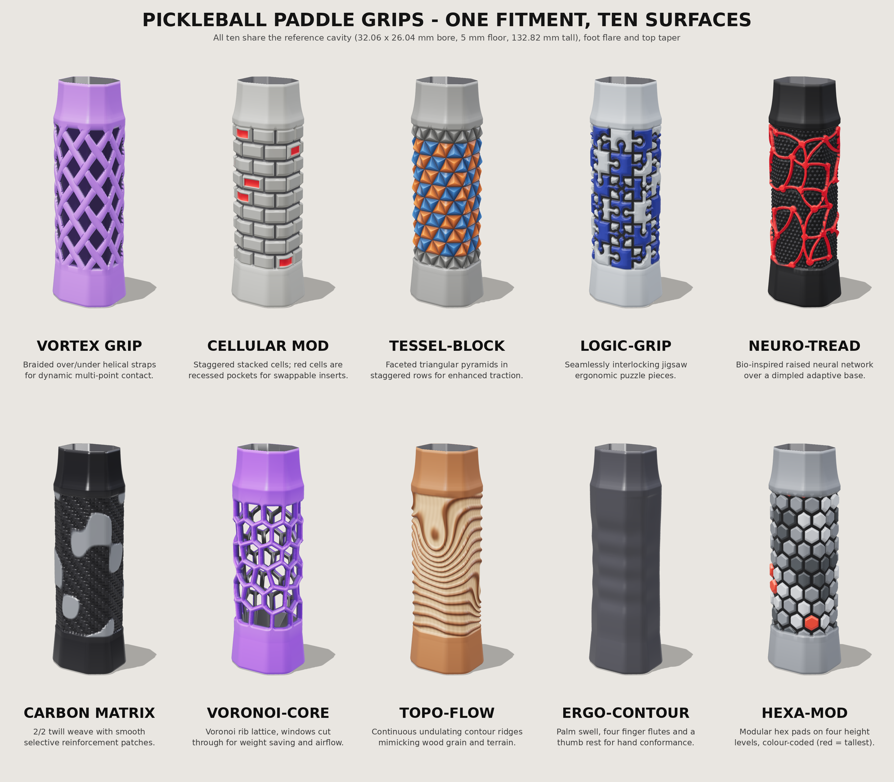
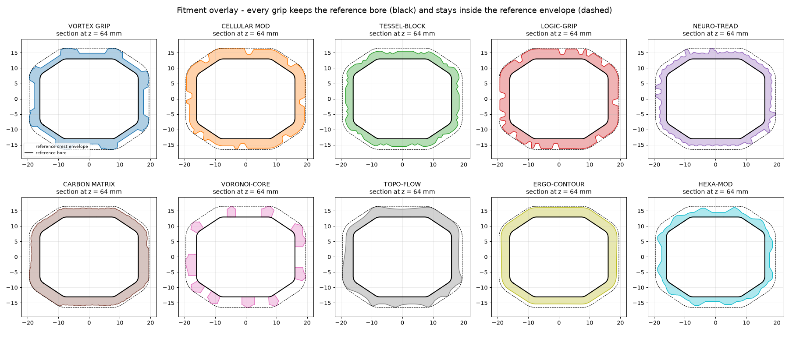

# Pickleball paddle grips - ten designs, one fitment

Ten printable grip sleeves generated from the catalog image, all built on the **exact fitment of
`reference/PickleballGrip_1.3mf`** (your pickleball handle sleeve).  Only the outer surface differs.



## What is identical on all ten (measured from your 3MF)

| Feature | Value |
|---|---|
| Overall height | **132.823 mm** (open top, flat rim) |
| Bore (cavity) | octagonal, **32.06 x 26.04 mm**, area 751.021 mm2, constant along z, floor at **z = 5.0** mm |
| Bore outline | the reference polygon itself (76 vertices, copied verbatim - no re-modelling) |
| Foot / butt flare | z 0-20: outer skin 5.29 (at z = 2) -> 3.54 mm from the bore (at z = 20), ~2 mm bottom fillet, flat closed butt (max 42.6 x 36.6 mm) |
| Textured zone | z 23-108 (smooth collars z 20-23 and 108-112): base wall **1.5 mm**, crest **3.5 mm** from the bore |
| Top taper | z 110 -> 132.823: skin tapers from 3.5 mm to 0.36 mm from the bore (same curve as the reference) |

Reference bounding box 42.64 x 36.62 x 132.823 mm; all ten grips: 42.63 x 36.61 x 132.82 mm.

## The ten grips

| # | Design | File | Concept | Volume cm3 | Triangles |
|---|---|---|---|---|---|
| 01 | **VORTEX GRIP** | `stl/01_vortex_grip.stl` | 8 + 8 counter-wound straps (36 deg helix) braided over/under; dark valleys between straps give multi-point contact. | 44.31 | 372,400 |
| 02 | **CELLULAR MOD** | `stl/02_cellular_mod.stl` | 9 rows x 8 staggered cells, 1.4 mm gaps; cells on 3 heights, ~22% recessed as insert pockets (red in the preview). | 43.61 | 180,960 |
| 03 | **TESSEL-BLOCK** | `stl/03_tessel_block.stl` | 10 rows x 24 triangles (12 up + 12 down per row, 10.2 mm base), each a faceted pyramid; up-triangles stand taller than down-triangles. | 40.43 | 371,420 |
| 04 | **LOGIC-GRIP** | `stl/04_logic_grip.stl` | 8 x 6 interlocking jigsaw pieces with mushroom knobs, 1.1 mm grooves, shallow dome tops. | 42.78 | 371,420 |
| 05 | **NEURO-TREAD** | `stl/05_neuro_tread.stl` | Periodic Delaunay 'neuron' graph: curved 1.5 mm axon ridges, soma nodes, over a hex-packed bump base (2.7 mm pitch). | 40.22 | 372,400 |
| 06 | **CARBON MATRIX** | `stl/06_carbon_matrix.stl` | 2/2 twill weave (2 mm tow pitch) with smooth raised reinforcement patches (selective reinforcing). | 47.4 | 370,440 |
| 07 | **VORONOI-CORE** | `stl/07_voronoi_core.stl` | Lloyd-relaxed Voronoi rib lattice (2.6 mm ribs, rounded tops); 54 cells cut clean through the wall for weight and airflow. | 32.0 | 168,368 |
| 08 | **TOPO-FLOW** | `stl/08_topo_flow.stl` | Contour ridges of a terrain/wood-knot height field - continuous undulating lines flowing around four knots. | 44.88 | 370,440 |
| 09 | **ERGO-CONTOUR** | `stl/09_ergo_contour.stl` | Smooth hour-glass swell, palm pad on the back, four finger flutes and a thumb dish on the front face. | 47.73 | 69,394 |
| 10 | **HEXA-MOD** | `stl/10_hexa_mod.stl` | 12-column hex pads (10.2 mm across flats), 1.7 mm gaps, four height levels (red = tallest). | 40.62 | 278,320 |

Close-ups: `renders/<id>_detail.png`; four-way turntable line-ups: `renders/<id>_lineup.png`;
hero shots: `renders/<id>_hero.png`.  Colours in the renders are **preview only** - the STLs are single-material.

## Fitment verification (`scripts/verify_fitment.py`, full data in `fitment_report.json`)

Every STL is cross-sectioned at 40 heights against the reference profile.

| Design | Result | Watertight | Height mm | Max outside ref. envelope mm | Foot / taper profile err mm | Bore wall on grip surface | Material inside bore mm2 |
|---|---|---|---|---|---|---|---|
| VORTEX GRIP | PASS | yes | 132.823 | +0.003 | 0.007 / 0.003 | 100% | 0.000 |
| CELLULAR MOD | PASS | yes | 132.823 | +0.003 | 0.007 / 0.003 | 100% | 0.000 |
| TESSEL-BLOCK | PASS | yes | 132.823 | +0.003 | 0.007 / 0.003 | 100% | 0.000 |
| LOGIC-GRIP | PASS | yes | 132.823 | +0.003 | 0.007 / 0.003 | 100% | 0.000 |
| NEURO-TREAD | PASS | yes | 132.823 | +0.003 | 0.007 / 0.003 | 100% | 0.000 |
| CARBON MATRIX | PASS | yes | 132.823 | +0.003 | 0.007 / 0.003 | 100% | 0.000 |
| VORONOI-CORE | PASS | yes | 132.823 | +0.003 | 0.007 / 0.003 | 63% | 0.000 |
| TOPO-FLOW | PASS | yes | 132.823 | +0.003 | 0.007 / 0.003 | 100% | 0.000 |
| ERGO-CONTOUR | PASS | yes | 132.823 | +0.003 | 0.007 / 0.003 | 100% | 0.000 |
| HEXA-MOD | PASS | yes | 132.823 | +0.003 | 0.007 / 0.003 | 100% | 0.000 |

* *Max outside ref. envelope* - how far the outer skin ever exceeds the reference's own outer envelope (positive = bigger).
* *Bore wall on grip surface* - share of sampled reference-bore points that lie on the grip's surface.  100% = the bore
  is identical; VORONOI-CORE is lower **by design** because its windows open the wall (the bore itself is unchanged).
* *Material inside bore* - area of material within the bore shrunk by 0.1 mm, worst case over 40 heights (must be 0).
* Floor at z = 5 and open top confirmed on all ten; each STL is one closed manifold body (VORONOI-CORE has 54 through-windows).



## Printing notes

* Print **upright, butt-end down** (same orientation as the reference).  Outer skins are limited to 45 degrees of
  overhang (each texture grows outward by at most 1 mm per mm of height), so they should print without supports.
  VORONOI-CORE's windows have angled roofs that must bridge a few mm - fine for most printers, but preview the slice.
* Grooves, gaps and ribs are 1.0 mm or wider; the finest texture is the carbon weave (2 mm tow pitch, ~0.3 mm relief).
* **Inherited from your reference:** the tapered top ends in a rim only ~0.36 mm thick, thinner than one 0.4 mm line.  I kept it
  identical so the fit and feel at the throat are unchanged; if your slicer complains, thicken the last ~3 mm.
* Surfaces are sampled every 0.25 mm; the STLs are 3-19 MB each (146 MB total).  `python3 scripts/generate_grips.py --res 0.35` makes lighter files.
* These are geometry-verified (watertight, cross-section-checked against your 3MF) but I have not run them through a slicer
  or printed them - do a preview slice before committing filament.

## Regenerating

```
pip install numpy scipy trimesh shapely manifold3d pillow mapbox_earcut matplotlib playwright
cd scripts
python3 extract_reference_profile.py          # reference 3MF -> data/reference_profile.json
python3 generate_grips.py                     # -> stl/*.stl   (~15 s)
python3 verify_fitment.py                     # -> fitment_report.json
npm install && python3 render_grips.py --catalog   # -> renders/*.png (headless Chromium + three.js)
python3 make_fit_overlay.py
```

`grip_core.py` wraps a height-field skin around the reference bore (P = bore point + h * normal + z), `designs.py` holds the ten texture
functions - edit one and re-run to iterate on a design.  Numbers above (relief levels, counts, sizes) are the constants in that file.

## Interpretation notes

The catalog image is a concept render, and a few captions are garbled ("Seal baiking helical structures"), so each design is my
interpretation of the picture and caption rather than a copy.  CELLULAR MOD's red pockets are printable recesses sized for
inserts, but no separate insert parts are included.
